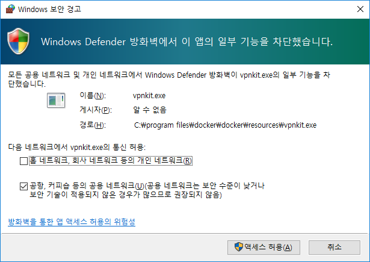
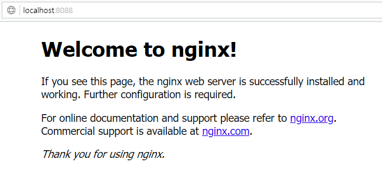

### 도커 핸즈온(2/4)  
  
- 웹서버 이미지 띄워보기(nginx)  
~~~
(base) E:\Data\블록체인\뷰티풀체인\dockerHandsOn>docker run --name nginx-test -p 8088:80 -d nginx
Unable to find image 'nginx:latest' locally
latest: Pulling from library/nginx
5e6ec7f28fb7: Pull complete
ab804f9bbcbe: Pull complete
052b395f16bc: Pull complete
Digest: sha256:56bcd35e8433343dbae0484ed5b740843dd8bff9479400990f251c13bbb94763
Status: Downloaded newer image for nginx:latest
a5d1d2faaa63064fd8d99eb581506340b46e6299fa6f9fe5aff22a69f3c883cc

(base) E:\Data\블록체인\뷰티풀체인\dockerHandsOn>docker images
REPOSITORY          TAG                 IMAGE ID            CREATED             SIZE
nginx               latest              42b4762643dc        6 days ago          109MB

(base) E:\Data\블록체인\뷰티풀체인\dockerHandsOn>docker ps -all
CONTAINER ID        IMAGE               COMMAND                  CREATED             STATUS              PORTS                  NAMES
a5d1d2faaa63        nginx               "nginx -g 'daemon of…"   12 minutes ago      Up 12 minutes       0.0.0.0:8088->80/tcp   nginx-test
~~~  
  (1) 이 때, 보안 경고 창이 나오면 엑세스 허용을 클릭하자.  
  
  (2) 웹브라우저에 URL[http://localhost:8088](http://localhost:8088) 을 확인한다.  
  
- 
