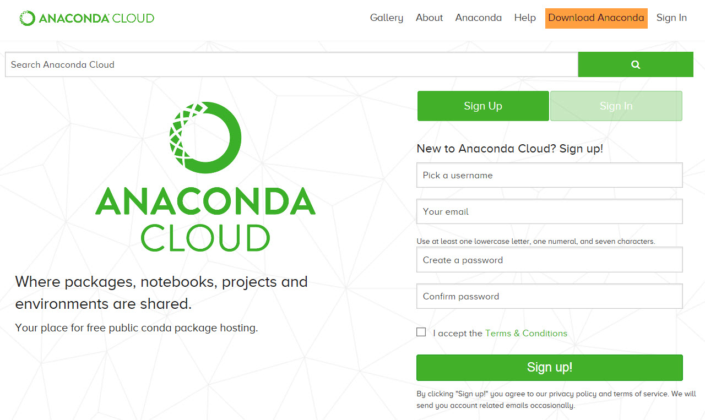
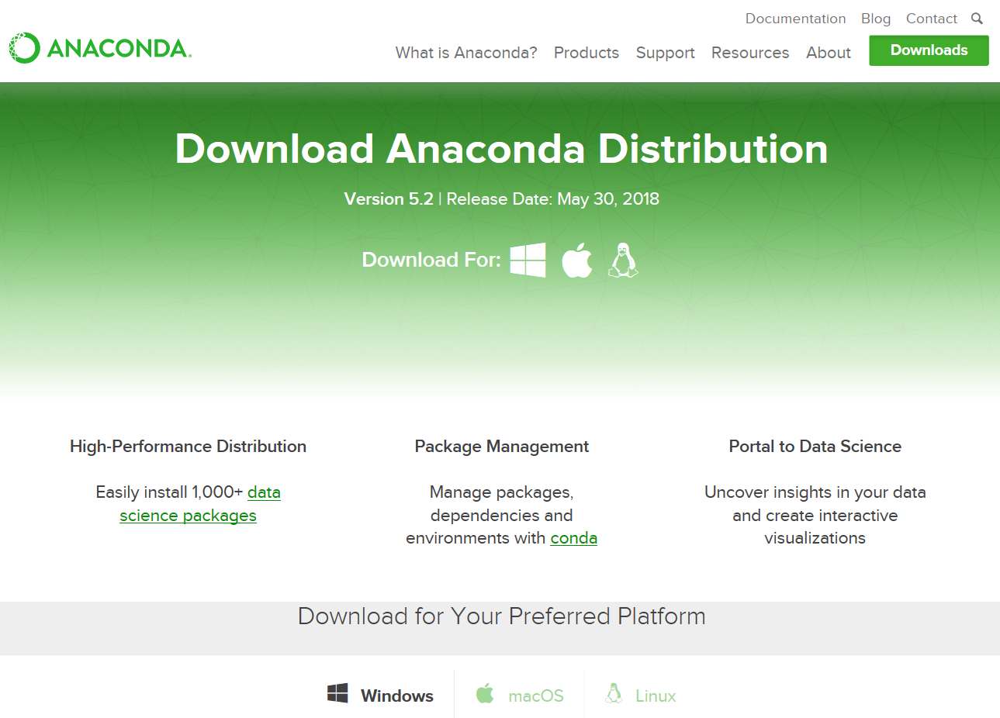
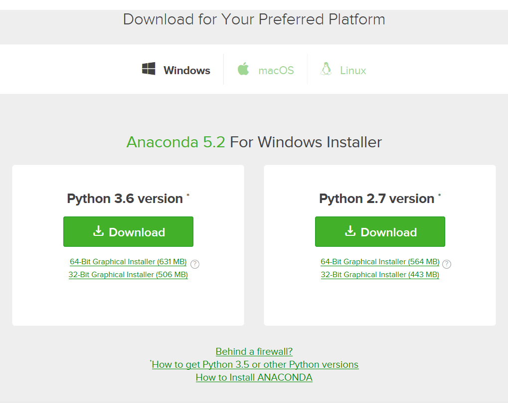

## 파이썬 설치하기  
  
### 아나콘다를 사용해보자  
  
  1) 구글에서 검색되는 아나콘다는 ~~뱀인가요?~~  
  2) anaconda로 검색합니다.  
  3) https://anaconda.org 혹은 https://anaconda.com 이 검색결과로 나옵니다.  
  4) 뭐 어디든 들어가 봅니다.  
    
    
  5) 다운로드(Download) 클릭합니다.(위 그림에서 주황색 표시)  
  6) 다운로드 페이지에서 운영체제(OS)를 고릅니다.  
  윈도우, 맥, 리눅스 다 지원합니다.  
  Windows? macOS? Linux?  
    
  7) 아마 윈도우 고르셨겠죠?  
  우리는 파이선(Python) 3.6 버전을 사용합니다.  
  아키텍처는 64비트? 32비트?  
    
  8) 다운로드 완료^^  
    
  
### 아나콘다 다운로드

### 아나콘다 설치
