## 파이썬 설치하기  
  
### [아나콘다 다운로드](./01_Download_Anaconda.md)  
  
### 아나콘다 설치하기  
  
  1) 보통 다운로드 폴더에 설치파일이 받아집니다.  
  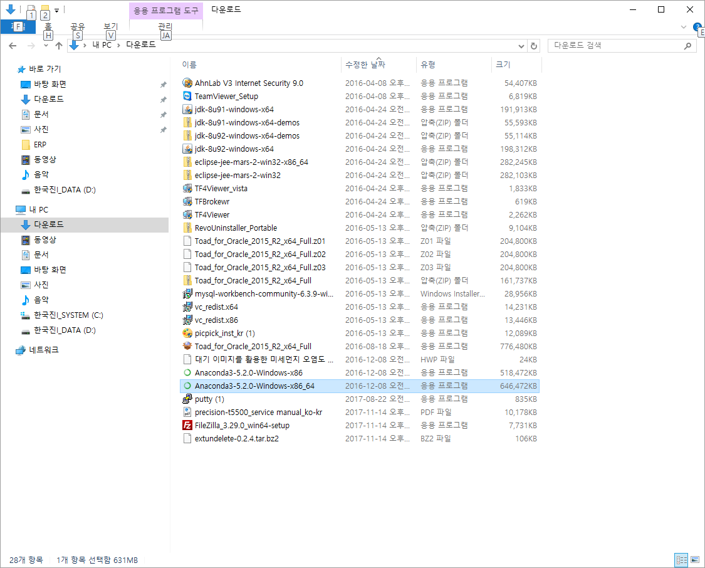  
  2) 더블클릭 등으로 설치를 시작합니다.  
  Next를 클릭합니다.  
  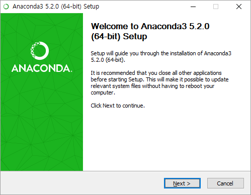  
  3) 사용권 게시로 Next를 클릭합니다.  
  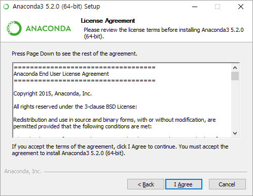  
  4) 환경구성을 지금 계정에만 할지, 전체에 할지에 대한 내용으로 Next를 클릭합니다.
  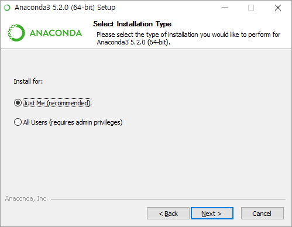  
  5) 파이썬 등을 설치할 폴더를 되도록 변경하시는 것이 좋습니다.  
  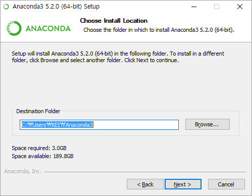  
  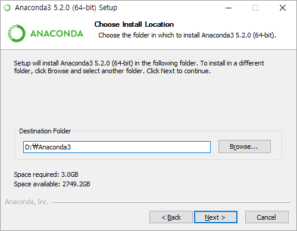  
  6) 이후 모든 설정은 기본값으로 진행합니다.  
  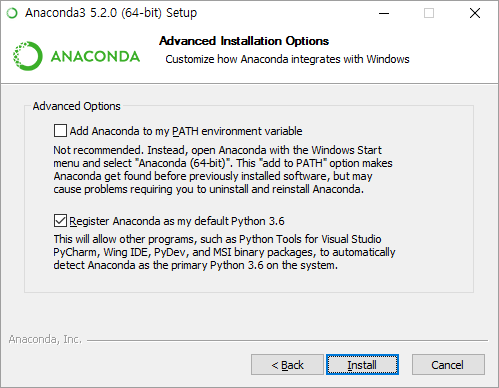  
  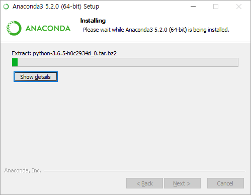  
  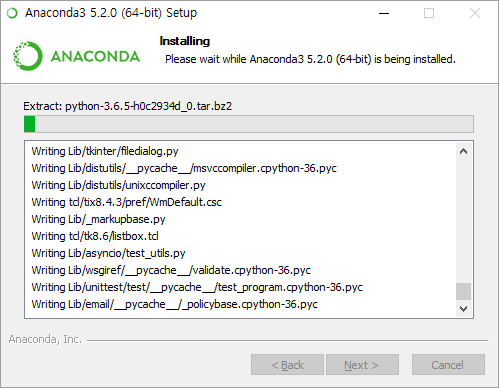  
  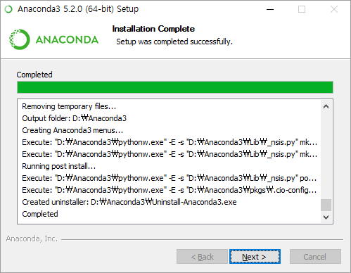  
  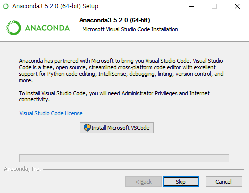  
  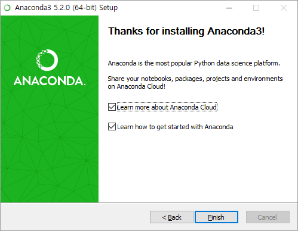  
  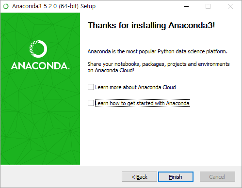  
  
### [주피터 노트북 실행](./03_Jupyter_Notebook.md)
