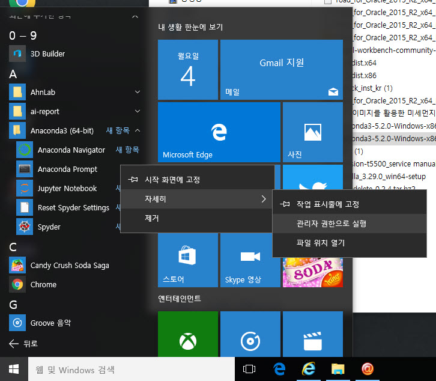
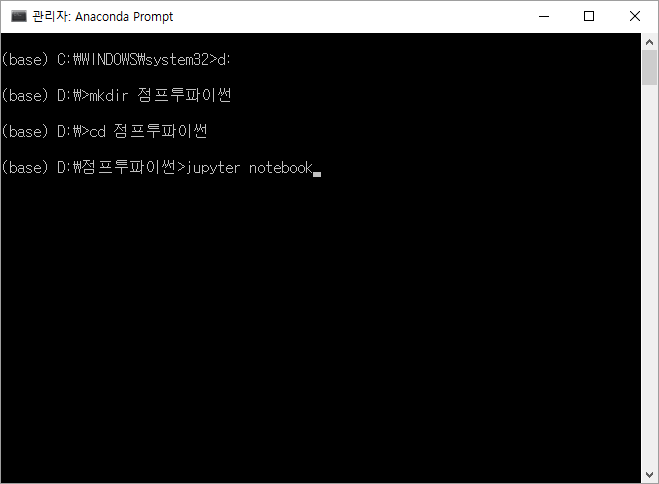
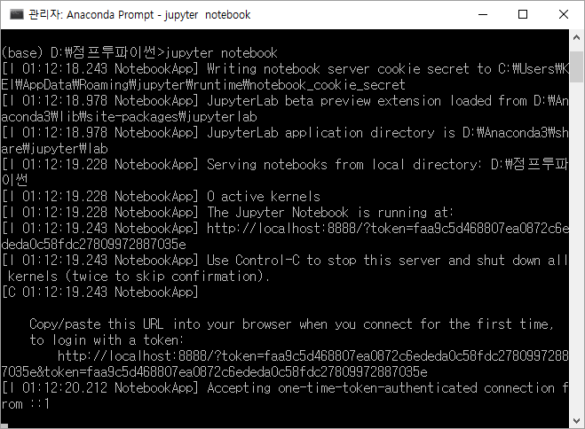
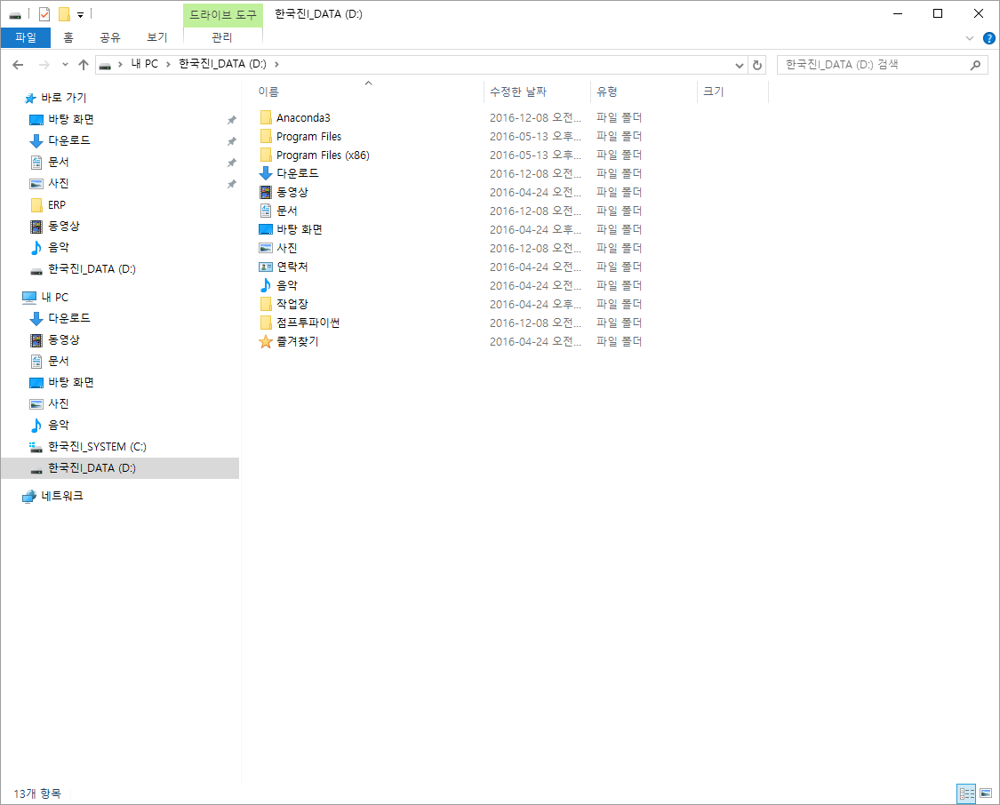
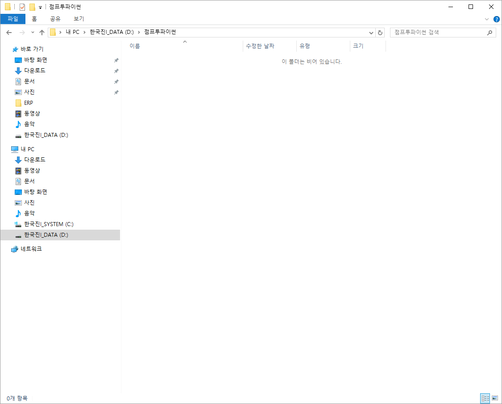
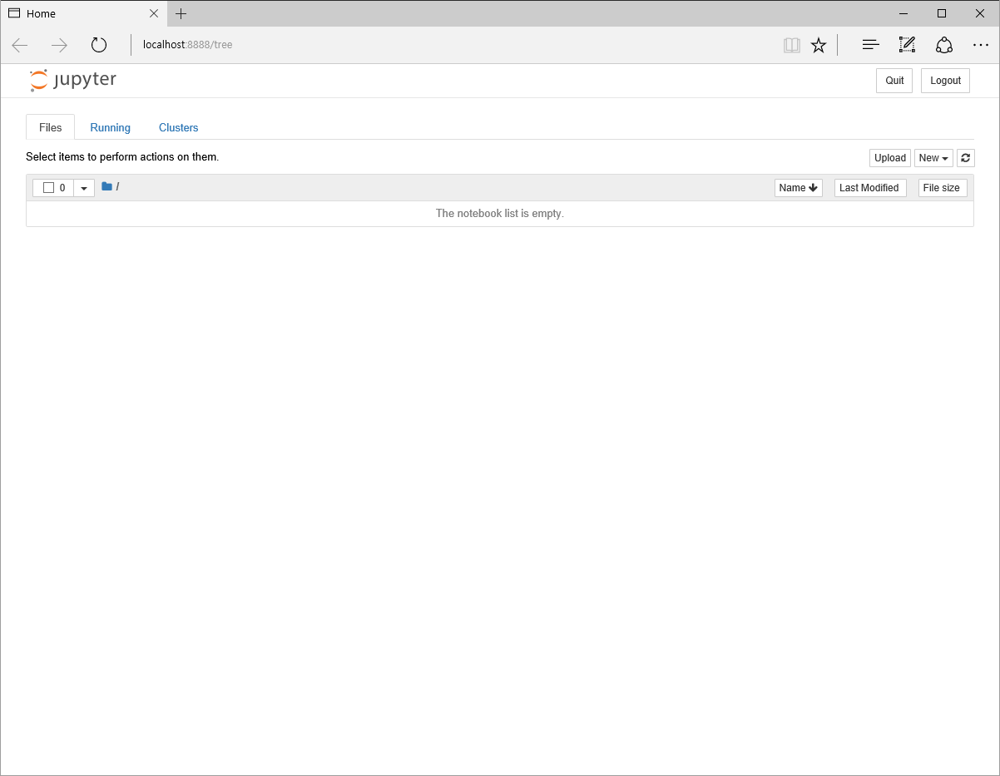

## 파이썬 설치하기  

### 주피터 노트북 실행하기  
  
  1) 아나콘다 프롬프트(Anaconda Prompt)를 관리자 권한으로 실행합니다.  
    
  2) ~~아니 시대가 어떤 시댄데, 클릭도 부족할 판에~~  
  주피터 노트북을 실행하고자 하는 경로로 이동합니다.  
  기본은 C 드라이브입니다. 다른 드라이브로 이동하고 싶으면 "드라이명": 하면 됩니다.  
  mkdir "폴더명" 하면, 폴더도 만들어 주고요.  
  cd "폴더명" 하면, 그 위치로 이동하고요.  
  원하는 곳에 가서 jupyter notebook 을 입력합니다. ~~짠짜라 짠^^~~   
    
  3) ~~뭐라는 겨?~~ 아래 http://localhost:8888/ 줄의 token= 이후를 드래그 하고 마우스 오른쪽 버튼을 클릭하면  
  드래그 한 영역이 사라지면서 그 내용이 메모리에 저장됩니다.~~복붙이 가능하다는~~  
    
  4) 탐색기로 보면 해당 위치에 폴더도 있고요.  
    
    
  5) 웹브라우저도 실행되어 있습니다. ~~오~~~  
    
  6) 시작은 파일명 설정부터  
  7) 
